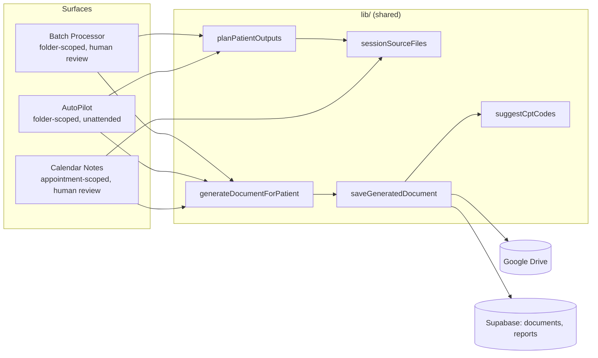

# Clinical Docs App — Design Notes

This document describes how AI-generated clinical documentation flows through
the app today, and sketches five candidate features for future work. It's a
living document — update it as the architecture changes, don't let it drift
into stale prose.

## 1. Architecture overview

Three surfaces generate documents, and all three funnel through the same
shared pipeline so behavior can't quietly diverge between them:

### Source-file planning (`lib/sessionSourceFiles.js`, `lib/documentPipeline.js`)

- `getSessionSourceFiles(files, patterns)` finds Zoom-note / Notes-by-Gemini /
  transcript-style files by name pattern and sorts them oldest-first by a
  date extracted from the filename (`lib/dateExtraction.js`).
- `planPatientOutputs(patient, docTypeKey, settings)` is the single source of
  truth for "what will actually get generated": for `session_note` it plans
  one DARP note per session-source file (not one merged note); for
  `treatment_plan` it plans a **bootstrap** DARP note from the oldest session
  file first (`isBootstrap: true`), then the plan itself
  (`dependsOnKey: <bootstrap key>`) so the plan's prompt gets that note as
  Pass-1 context.
- `resolveSessionSourcePatterns(settings)` reads the user's customized
  `session_note` → `session_source` rule from Settings, so planning respects
  the same patterns the Verify Source Files checkboxes show — never a
  hard-coded list the user can't see or change.
- Every planned output carries a `dedupeSuffix` (`-1`, `-2`, …) so multiple
  same-dated (or undated) session files never collide on output filename —
  `computeOutputFileNameBase()` is the only place a filename is computed, and
  it's called once at plan time and reused unchanged through save.

### Generation (`lib/documentPipeline.js`, `lib/aiEngine.js`)

- `generateDocumentForPatient()` builds the prompt for one output and calls
  the configured AI provider. A `bootstrapNoteHtml` param, when present, gets
  folded into a Treatment Plan's prompt as extra context — this is how the
  Pass-1 dependency above actually reaches the model.
- `saveGeneratedDocument()` uploads to Drive, inserts into `documents`, and
  (if a `saveReport` callback is given) creates a **draft** `reports` row
  pre-filled with a suggested CPT code from `suggestCptCodes()` and a date of
  service resolved in priority order: explicit override → linked calendar
  occurrence → date extracted from source filenames → today.

### Per-surface specifics

| Surface | Scope | Review step? | Notes |
|---|---|---|---|
| **Batch Processor** | Patient folder, user-entered names | Yes — Confirm Outputs screen lists every planned output (files, filename) before generating; review queue after, with working **regenerate** per output | The reference implementation; everything else should behave the same way unless there's a structural reason not to |
| **AutoPilot** | Patient folder, watched on a timer | No — saves straight through | Plans *all* selected doc types up front so cross-type duplicates can be caught: if both `session_note` and `treatment_plan` are selected, the bootstrap note for the oldest session file is dropped in favor of the real per-file note (both would otherwise save as near-duplicate DARP notes with no human to catch it). Outputs are then reordered so dependencies generate before whatever depends on them. |
| **Calendar Notes** | Specific calendar appointment | Yes — same review-queue pattern as Batch Processor | Doesn't use `planPatientOutputs` directly (a calendar occurrence already pins down *which* session a note is for, so there's no "split into N notes" ambiguity). Instead: `pickBestSessionFile()` picks the one session-source file closest in date to the appointment; the Treatment Plan bootstrap pass runs the same way but **in-memory only** (not saved as its own document) — a calendar occurrence doesn't map onto an unrelated bootstrap note the way a patient folder does. |

### CPT suggestions (`lib/cptCodes.js`)

`suggestCptCodes(docTypeKey, minutes)` pre-fills the draft report created
alongside every generated document:

- `session_note` → `['99214', <duration-matched add-on, default 90836>]` —
  E/M + psychotherapy add-on is preferred over the intake-only `90792` per an
  earlier product decision.
- `pre_intake` → `['90792']`.
- `follow_up` → `['99213']`.
- `treatment_plan` → `[]` (no single code reliably fits; left for the
  clinician to pick based on whatever visit it's billed alongside).

This is explicitly a *starting point*, not a billing decision — the Reports
page's CPT picker and `cptValidation.js` still govern what's actually
submitted, and everything here is trivially editable.

## 2. Candidate future features

Ordered by how directly each one builds on what already exists — not by
priority. Each is a sketch, not a spec; the "Open questions" are things worth
resolving with the user before implementation, not things to guess past.

### 2.1 Billing readiness dashboard

**Problem:** Reports rows are auto-created as drafts with a suggested CPT
code, but nothing surfaces which ones are still incomplete (missing CPT
codes/minutes, or would fail `cptValidation.js`) before a billing cycle.

**Approach:** A view — likely a card on `HomeDashboard.jsx` or a filter on
`ReportsPage.jsx` — that runs `validateCptClaim()` across all reports in a
date range and lists ones with errors/warnings or a still-blank
`cpt_codes`/`psychotherapy_minutes`. Purely additive: no new tables, reuses
`cptValidation.js` as-is.

**Open questions:** what counts as "ready" (errors only, or warnings too)?
Does this replace or sit alongside the existing CSV export?

### 2.2 Per-patient clinical timeline

**Problem:** Generation History's "All Files" view (added earlier this
project) is a flat, cross-patient list sorted by date. There's no single
page to see one patient's whole documented history — treatment plans,
DARP notes, reports — in order.

**Approach:** A new route (`/patients/:name` or similar) that queries
`documents` and `reports` filtered by `patient_name` and renders them on one
timeline, reusing the existing preview/iframe pattern from
`DocumentReviewQueue`/`BatchProcessor`.

**Open questions:** does this need its own Supabase query/index, or is
client-side filtering of the already-cached `documents`/`reports` arrays in
`AppContext` sufficient at current data volumes?

### 2.3 Side-by-side version diff

**Problem:** `DocumentVersionHistory.jsx` already lists a document's versions
(via `version_number`/`previous_version_id`) but only as a flat list — there's
no way to see *what changed* between two versions without opening both.

**Approach:** Add a diff mode to `DocumentVersionHistory` — pick two versions,
render their `content_html` side by side (or word-diffed) using a small
client-side HTML/text diff. Given the CSP-style constraints elsewhere in this
app (sandboxed iframes for generated HTML), whatever diff renderer is chosen
needs to run on extracted text, not live HTML.

**Open questions:** diff the rendered text or the raw HTML? A structural diff
across `ai-prompt` spans specifically would be more useful than a raw text
diff but is more work.

### 2.4 AI-assisted E/M level suggestion

**Problem:** `suggestCptCodes()` always suggests `99214` (moderate MDM) for
session notes — a reasonable single default, but not informed by what the
note actually documents (risk factors, medication changes, complexity of the
visit).

**Approach:** After a session note is generated, a lightweight follow-up
pass (or a second structured-output prompt in the same call) reads the
generated content and picks 99213/99214/99215 based on documented complexity,
still surfaced as an editable suggestion — never auto-submitted. This is the
one item here with real scope for over-reach: it must stay a suggestion
clinicians can freely override, with the same "never invent facts" discipline
`buildSystemPrompt()` already enforces for note content.

**Open questions:** worth a dedicated AI call (cost/latency) versus a
deterministic heuristic (e.g. counting documented risk factors)? Needs a
product decision on how confident the heuristic must be before suggesting a
level at all.

### 2.5 AutoPilot run digest

**Problem:** AutoPilot runs unattended with no review step. If a run fails
silently (bad source file, transient API error) while nobody's watching the
tab, nothing surfaces that until someone happens to check the Activity Log.

**Approach:** At the end of each `runCycle`, build a summary (patients
processed, documents saved, skipped, errored) and surface it — at minimum a
persisted "last run summary" shown on the AutoPilot page itself; ideally an
email/notification via a Supabase Edge Function for real unattended
visibility. Errors already fail loudly in-run (no `lastChecked` advance, see
`AutoPilotPage.jsx`); this is about making that visible without requiring the
tab to be open.

**Open questions:** in-app only, or an actual notification channel (email)?
If email, that's a new Edge Function and a "notify me" setting.
