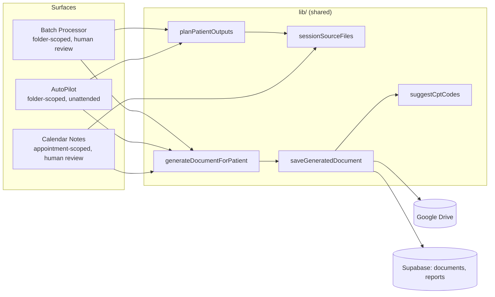

# Clinical Docs App — Design Notes

This document describes how AI-generated clinical documentation flows through
the app today, and sketches five candidate features for future work. It's a
living document — update it as the architecture changes, don't let it drift
into stale prose.

## 1. Architecture overview

Three surfaces generate documents, and all three funnel through the same
shared pipeline so behavior can't quietly diverge between them:

### Source-file planning (`lib/sessionSourceFiles.js`, `lib/documentPipeline.js`)

- `getSessionSourceFiles(files, patterns)` finds Zoom-note / Notes-by-Gemini /
  transcript-style files by name pattern and sorts them oldest-first by a
  date extracted from the filename (`lib/dateExtraction.js`).
- `planPatientOutputs(patient, docTypeKey, settings)` is the single source of
  truth for "what will actually get generated": for `session_note` it plans
  one DARP note per session-source file (not one merged note); for
  `treatment_plan` it plans a **bootstrap** DARP note from the oldest session
  file first (`isBootstrap: true`), then the plan itself
  (`dependsOnKey: <bootstrap key>`) so the plan's prompt gets that note as
  Pass-1 context.
- `resolveSessionSourcePatterns(settings)` reads the user's customized
  `session_note` → `session_source` rule from Settings, so planning respects
  the same patterns the Verify Source Files checkboxes show — never a
  hard-coded list the user can't see or change.
- Every planned output carries a `dedupeSuffix` (`-1`, `-2`, …) so multiple
  same-dated (or undated) session files never collide on output filename —
  `computeOutputFileNameBase()` is the only place a filename is computed, and
  it's called once at plan time and reused unchanged through save.

### Generation (`lib/documentPipeline.js`, `lib/aiEngine.js`)

- `generateDocumentForPatient()` builds the prompt for one output and calls
  the configured AI provider. A `bootstrapNoteHtml` param, when present, gets
  folded into a Treatment Plan's prompt as extra context — this is how the
  Pass-1 dependency above actually reaches the model.
- `saveGeneratedDocument()` uploads to Drive, inserts into `documents`, and
  (if a `saveReport` callback is given) creates a **draft** `reports` row
  pre-filled with a suggested CPT code from `suggestCptCodes()` and a date of
  service resolved in priority order: explicit override → linked calendar
  occurrence → date extracted from source filenames → today.

### Per-surface specifics

| Surface | Scope | Review step? | Notes |
|---|---|---|---|
| **Batch Processor** | Patient folder, user-entered names | Yes — Confirm Outputs screen lists every planned output (files, filename) before generating; review queue after, with working **regenerate** per output | The reference implementation; everything else should behave the same way unless there's a structural reason not to |
| **AutoPilot** | Patient folder, watched on a timer | No — saves straight through | Plans *all* selected doc types up front so cross-type duplicates can be caught: if both `session_note` and `treatment_plan` are selected, the bootstrap note for the oldest session file is dropped in favor of the real per-file note (both would otherwise save as near-duplicate DARP notes with no human to catch it). Outputs are then reordered so dependencies generate before whatever depends on them. |
| **Calendar Notes** | Specific calendar appointment | Yes — same review-queue pattern as Batch Processor | Doesn't use `planPatientOutputs` directly (a calendar occurrence already pins down *which* session a note is for, so there's no "split into N notes" ambiguity). Instead: `pickBestSessionFile()` picks the one session-source file closest in date to the appointment; the Treatment Plan bootstrap pass runs the same way but **in-memory only** (not saved as its own document) — a calendar occurrence doesn't map onto an unrelated bootstrap note the way a patient folder does. |

### CPT suggestions (`lib/cptCodes.js`)

`suggestCptCodes(docTypeKey, minutes)` pre-fills the draft report created
alongside every generated document:

- `session_note` → `['99214', <duration-matched add-on, default 90836>]` —
  E/M + psychotherapy add-on is preferred over the intake-only `90792` per an
  earlier product decision.
- `pre_intake` → `['90792']`.
- `follow_up` → `['99213']`.
- `treatment_plan` → `[]` (no single code reliably fits; left for the
  clinician to pick based on whatever visit it's billed alongside).

This is explicitly a *starting point*, not a billing decision — the Reports
page's CPT picker and `cptValidation.js` still govern what's actually
submitted, and everything here is trivially editable.

### Patient-facing content actions (`ClientFacingActions.jsx`)

The Pre-Intake template's "Client-Facing Materials" block contains two
sections meant to leave the clinical record as-is and go to the patient
directly: an **Empathetic Patient Summary Letter** and **Client-Facing
Psychoeducation**. `lib/clientFacingSections.js` extracts either one out of a
generated document's HTML by heading text (not document type, so it keeps
working if the template moves them), and `ClientFacingActions.jsx` — wired
into `DocumentReviewQueue`, Calendar Notes' review queue, and
`PatientTimelinePage` — renders per-section actions:

- **Copy** — clipboard, for pasting into an EHR or elsewhere.
- **Gmail** — opens a prefilled Gmail *compose* window
  (`lib/gmailCompose.js`) rather than sending anything itself. Deliberately
  not a Gmail API `gmail.send` integration: that scope is a materially more
  sensitive consent than the Drive/Calendar scopes already in use, and email
  isn't end-to-end encrypted — having the app transmit patient-facing
  content directly is a real compliance surface that needs its own explicit
  design pass (recipient verification, audit trail, BAA coverage) before
  it's worth doing. This gets the workflow benefit (no retyping/reformatting)
  without that risk: the clinician still reviews and hits send themselves,
  in their own Gmail.
- **PDF Handout** (Psychoeducation only) — composes the section with 0–2
  matched diagrams into a standalone PDF via the existing `htmlToPdfBlob()`.
  The diagrams (`lib/psychoeducationDiagrams.js`) are a small, hand-authored
  SVG set (sleep hygiene, CBT thought cycle, medication schedule) matched by
  keyword against the section text — not AI image generation. No
  image-generation provider is wired into this app, and adding one for this
  would mean new cost-per-generation and a real risk of inaccurate or
  off-brand medical imagery that would need clinical review before every
  use. The curated set trades flexibility for zero hallucination risk.

## 2. Candidate future features

Ordered by how directly each one builds on what already exists — not by
priority. Each is a sketch, not a spec; the "Open questions" are things worth
resolving with the user before implementation, not things to guess past.

### 2.1 Billing readiness dashboard — **implemented**

**Problem:** Reports rows are auto-created as drafts with a suggested CPT
code, but nothing surfaces which ones are still incomplete (missing CPT
codes/minutes, or would fail `cptValidation.js`) before a billing cycle.

**Shipped:** `lib/billingReadiness.js` — `assessReportReadiness(report)` runs
`validateCptClaim()` and additionally treats a still-empty `cpt_codes` as
not-ready (errors only decide readiness; warnings, like a missing
`psychotherapy_minutes` on an otherwise-valid claim, don't). `ReportsPage.jsx`
gets a clickable "Needs Attention" stat tile that filters the table down to
exactly those rows, plus a per-row warning icon next to the CPT column so an
entry needing attention is visible even outside the filtered view. Purely
additive — no new tables, reuses `cptValidation.js` as-is, sits alongside the
existing CSV export rather than replacing it.

**Open question resolved:** "ready" means errors-only (matches the same
draft-entry policy `cptValidation.js` already documents: an incomplete draft
is expected and not itself an error).

### 2.2 Per-patient clinical timeline — **implemented**

**Problem:** Generation History's "All Files" view (added earlier this
project) is a flat, cross-patient list sorted by date. There's no single
page to see one patient's whole documented history — treatment plans,
DARP notes, reports — in order.

**Shipped:** `PatientTimelinePage.jsx` at `/patients/:name`, linked from
Generation History's "All Files" list. Queries `documents` and `reports`
filtered by `patient_name` directly (not the capped `AppContext` caches, so
older history isn't silently truncated) and merges them into one
chronological view, reusing the existing preview/iframe pattern from
`DocumentReviewQueue`.

**Known limitation:** the route and query key off `patient_name`, the same
identifier used everywhere else in this app (`documents`, `reports`,
`generation_errors`, `fetchLatestDocument`, …) — there's no `patients` table
with a stable opaque ID anywhere in the current schema. That means this is
the first place a patient identifier appears in the browser's URL/history,
which is a real (if narrow) PHI-exposure surface beyond what the rest of the
app already has — client-side routing means it's never sent over the network
as a `Referer`, but it does sit in local browser history and would show up
in any client-side analytics if those were ever added. Properly fixing this
means introducing opaque patient IDs across the whole data model (a new
`patients` table, foreign keys on `documents`/`reports`/etc., a migration) —
a much larger, cross-cutting change than this feature, and one that should
be a deliberate decision rather than a side effect of adding a timeline
view. Flagging it here rather than silently accepting the risk.

**Regenerate as a new version:** `handleRegenerateVersion()` closes the gap
flagged in 2.3 below — it re-collects a document's source files from Drive
(via the same configured Source File Rules Batch Processor uses), regenerates
the content, and calls `AppContext.regenerateDocument()` to persist it as a
new `version_number`. `regenerateDocument()` itself was patched to fall back
to fetching the original row directly when it isn't in the capped
`AppContext.documents` cache — otherwise regenerating an older patient's
document from this very page would silently fail for the same reason this
page exists in the first place.

### 2.3 Side-by-side version diff — **implemented**

**Problem:** `DocumentVersionHistory.jsx` already lists a document's versions
(via `version_number`/`previous_version_id`) but only as a flat list — there's
no way to see *what changed* between two versions without opening both.

**Shipped:** a "Compare Versions" toggle in `DocumentVersionHistory.jsx` lets
a clinician check exactly two versions; `VersionDiffView.jsx` then renders a
word-level diff (`lib/textDiff.js`) between them, with additions/removals
highlighted inline. The diff runs on **extracted text, not raw HTML** — an
`htmlToText()` regex strip, not a live-DOM parse — matching the sandboxed-
iframe discipline used everywhere else generated HTML is shown, and avoiding
a dependency on the `diff` package (not in `package.json`). The underlying
LCS word-diff is O(n·m); a size guard bails out (with a message instead of a
result) rather than let an oversized version pair hang the tab.

Also newly wired `DocumentVersionHistory.jsx` into `PatientTimelinePage.jsx`
(per expanded document) — it existed as a component but wasn't reachable from
any page before this, so without that wiring the diff feature would have
shipped with no way to actually open it.

**Open question resolved:** diffs the rendered text, not raw HTML or an
`ai-prompt`-span structural diff — cheaper and safer given the sandboxing
constraint above; the trade-off is that formatting-only changes (bold, list
structure) won't show, which the diff view says explicitly.

### 2.4 AI-assisted E/M level suggestion — **implemented**

**Problem:** `suggestCptCodes()` always suggests `99214` (moderate MDM) for
session notes — a reasonable single default, but not informed by what the
note actually documents (risk factors, medication changes, complexity of the
visit).

**Shipped:** a deterministic keyword heuristic, `suggestEmLevel()` in
`lib/cptCodes.js`, not a second AI call — no added cost/latency, and no risk
of a model inventing complexity signals that aren't in the note (the same
"never invent facts" discipline `buildSystemPrompt()` enforces for note
content applies here too). It scans the generated note's stripped text for
high-complexity signals (SI/HI, hospitalization, crisis, non-adherence, …)
and stable/low-complexity signals, and picks 99215/99213/99214 accordingly,
defaulting to 99214 when signals are absent or conflicting. Still fully
editable in the Reports CPT picker — this only changes the *starting*
suggestion.

### 2.5 AutoPilot run digest — **implemented (in-app only)**

**Problem:** AutoPilot runs unattended with no review step. If a run fails
silently (bad source file, transient API error) while nobody's watching the
tab, nothing surfaces that until someone happens to check the Activity Log.

**Shipped:** `runCycle()` in `AutoPilotPage.jsx` now tracks aggregate counters
(patients scanned/processed/skipped/errored, documents saved) through the
run and, on both normal completion and an outer-level failure, persists them
as `settings.autoPilot.lastRunSummary` — a "Last Run Summary" card at the top
of the AutoPilot page shows these counts (and the error message, if the run
failed outright) whether or not the tab was open when the run happened. This
is deliberately the in-app half of the two options in the open question
below — no email/notification channel was built.

**Why aggregate-only, not the patient-level detail the Activity Log already
shows:** the Activity Log is in-memory only and resets on reload; persisting
`lastRunSummary` writes it into `settings`, which is backed by localStorage
(see `lib/settings.js`). Including patient names there would reintroduce
exactly the persisted-PHI-in-localStorage pattern fixed in PR #26 for the
Calendar Notes resume snapshot — so the persisted summary is counts only,
consistent with the PHI constraint below.

**Open question resolved (partially):** in-app only, for now — the email/
notification half is still explicitly out of scope; the PHI constraint below
still applies in full if that's ever built.

**PHI constraint (applies before any email/notification channel is built):**
keep the digest aggregate-only by default — counts of processed/saved/
skipped/errored, not patient names, note content, or unrestricted Drive
links. Sending any of that off-app requires its own design pass: recipient
authorization, payload limits, retention, audit logging, and link-access
controls. Don't bolt on email delivery casually just because a Supabase Edge
Function makes it easy.
